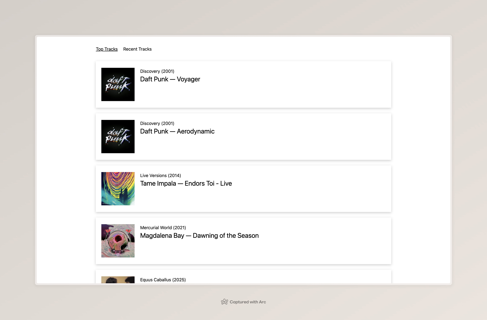
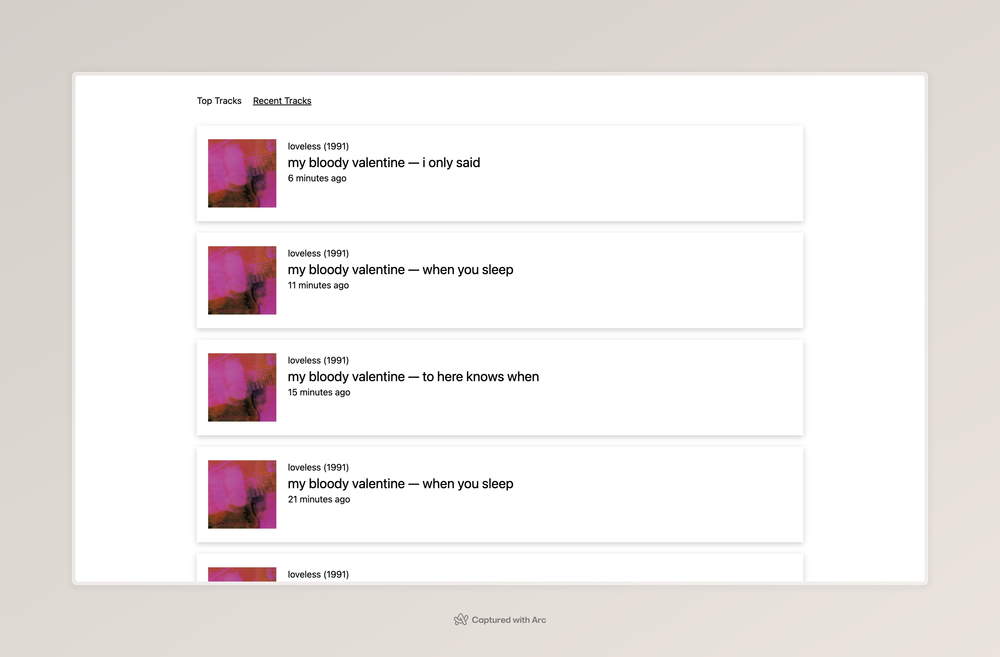

# Spotify Web API Explorer

React + Vite app that connects to the Spotify Web API. After authenticating with your Spotify account you can browse:
- **Top Tracks** (most played)
  
- **Recently Played** tracks with “played X minutes ago”
  
- Track detail modal with album art, duration, and “Open in Spotify” link
  

## Tech stack
- React 19, TypeScript, Vite, React Router
- Tailwind CSS 4
- Spotify Authorization Code flow

## Prerequisites
- Node.js 18+ and npm
- A Spotify Developer app (https://developer.spotify.com/dashboard) with **Client ID**, **Client Secret**, and a Redirect URI matching your local/dev URL (e.g. `http://localhost:5173`)

## Environment variables
Create a `.env` file in the project root (Vite requires the `VITE_` prefix):

```bash path=null start=null
VITE_SPOTIFY_CLIENT_ID=your_client_id
VITE_SPOTIFY_CLIENT_SECRET=your_client_secret
VITE_SPOTIFY_REDIRECT_URI=http://localhost:5173
```

Also add the same redirect URI in your Spotify app settings.

## Getting started
1. Install dependencies  
   ```bash path=null start=null
   npm install
   ```
2. Start the dev server  
   ```bash path=null start=null
   npm run dev
   ```
   Vite will print a local URL (default `http://localhost:5173`). Open it and click **Login with Spotify** to authorize.

## Available scripts
- `npm run dev` – start Vite dev server
- `npm run build` – type-check then build for production
- `npm run preview` – preview the production build
- `npm run lint` – run ESLint


